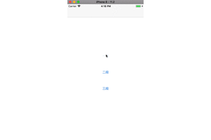

# XCDropdownSegment


[](https://travis-ci.org/fanxiaocong/XCDropdownSegment)
[](https://cocoapods.org/pods/XCDropdownSegment)
[](https://cocoapods.org/pods/XCDropdownSegment)
[](https://cocoapods.org/pods/XCPresentation)
[](https://www.apple.com/nl/ios/)&nbsp;

***
|Author|小小聪明屋|
|---|---|
|E-mail|1016697223@qq.com|
|GitHub|https://github.com/fanxiaocong|
|Blog|http://www.cnblogs.com/fanxiaocong|
***


## Example
简单封装的下拉列表，支持多段显示




### 代码

#### 创建视图

```objc
/**
 *  设置 UI
 */
- (void)setupUI
{
    XCDropdownSegment *segment = [[XCDropdownSegment alloc] initWithFrame:CGRectMake(0,80, SCREEN_WIDTH, 40)];
    segment.dataSource = self;
    segment.delegate   = self;
    self.segment = segment;
    [self.view addSubview:segment];
    
    [segment updateConfigure:^(XCDropdownSegmentConfigure *confi) {
        confi.rowHeight = 40;
        confi.segmentHeight = 40;
        confi.sectionHeight = 40;
        //根据项目需求更改图片
        confi.arrowUpImage   = ImageNamed(@"icon_arrow_up");
        confi.arrowDownImage = ImageNamed(@"icon_arrow_down");
        confi.headerTitleColor = [UIColor colorWithHexString:@"#333333"];
        confi.headerSelectedTitleColor = [UIColor colorWithHexString:@"#4180E9"];
    }];
    
    //视图代理
    self.segment.oneView.delegate = self;
    self.segment.twoView.delegate = self;
    self.segment.threeView.delegate = self;
    self.segment.fourView.delegate = self;
    
    //视图数据的传递
    [self.segment.oneView updateDataArr:self.dataArr];
    [self.segment.twoView updateDataArr:self.dataArr];
    [self.segment.threeView updateDataArr:self.dataArr];

    
}
```

</br>

#### `<XCDropdownSegmentDataSource.h>`&nbsp;数据源方法

`- (NSArray<NSString *> *)titlesOfHeaderInDropdownSegment:(XCDropdownSegment *)dropdownSegment`

段头标题显示的文字，可以是多段，需要一个数组返回

```objc
- (NSArray<NSString *> *)titlesOfHeaderInDropdownSegment:(XCDropdownSegment *)dropdownSegment
{
	return @[@"类型",@"行业", @"区域", @"日期"];
}
```
</br>
</br>

#### `<XCDropdownSegmentDelegate.h>`&nbsp;代理方法

`- (void)dropdownSegment:(XCDropdownSegment *)dropdownSegment
    didSelectHeaderInSection:(NSInteger)section`

点击第 section 段的头部的回调

</br>

`- (void)dropdownSegment:(XCDropdownSegment *)dropdownSegment didSelectRow:(NSInteger)row inSection:(NSInteger)section`

点击第 section 段的第 row 行的回调


## Installation

### CocoaPods
```objc
pod 'XCDropdownSegment'
```
